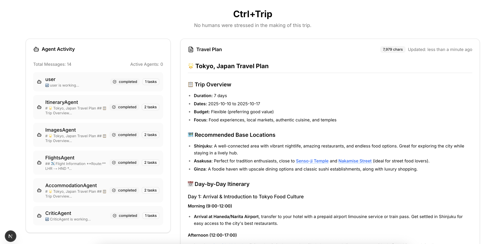
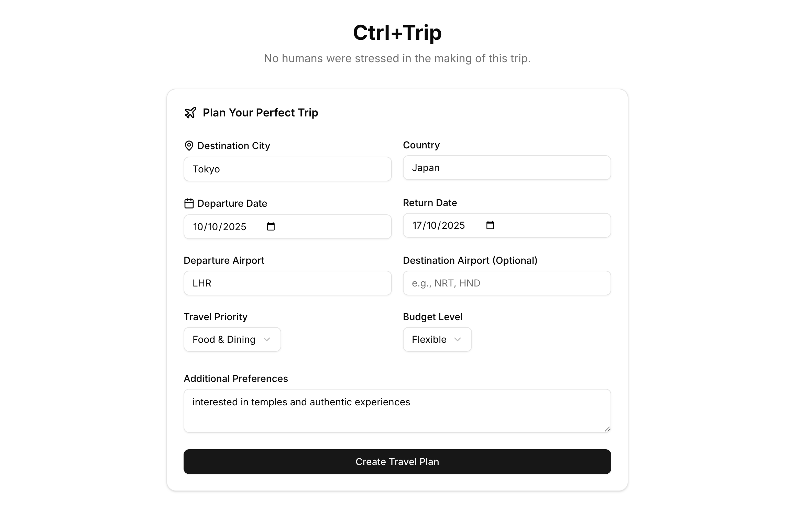

# 🌍 Multi-Agent AI Travel Planner

A full-stack AI-powered travel planning application that creates personalized travel itineraries using specialized AI agents with real-time streaming updates and an intuitive modern interface.



## 🎯 Overview

The AI Travel Planner is a comprehensive travel planning solution that combines the power of multiple AI agents with a modern web interface. Users simply input their travel preferences, and the system generates detailed, personalized travel plans in real-time, showing the AI agents working collaboratively to create the perfect itinerary.

### Key Highlights

- **🤖 Multi-Agent AI System**: 5 specialized AI agents working in sequence for comprehensive travel planning
- **⚡ Real-time Streaming**: Watch your travel plan being created live with agent activity monitoring
- **🎨 Modern Interface**: Clean, responsive React frontend built with Next.js 14 and shadcn/ui
- **🔧 Scalable Backend**: FastAPI-based microservice architecture with Azure OpenAI integration
- **📱 Full Responsiveness**: Seamless experience across desktop, tablet, and mobile devices

## 🏗️ Architecture

```
AI Travel Planner/
├── backend/                    # FastAPI Backend Service
│   ├── main.py                # Application entry point
│   ├── requirements.txt       # Python dependencies
│   └── app/
│       ├── api.py            # FastAPI routes and middleware
│       ├── models/           # Data models and schemas
│       ├── services/         # Business logic and AI agents
│       └── utils/            # Helper utilities
│
├── frontend/                  # Next.js React Frontend
│   ├── src/
│   │   ├── app/              # Next.js App Router pages
│   │   ├── components/       # React components
│   │   ├── lib/              # Utilities and API client
│   │   └── types/            # TypeScript definitions
│   ├── package.json
│   └── tailwind.config.js
│
└── README.md                 # This file
```

## 🚀 Quick Start

### Prerequisites

- **Backend**: Python 3.8+, Azure OpenAI API access
- **Frontend**: Node.js 18+, npm/yarn/pnpm
- **Optional**: Docker for containerized deployment

### 1. Clone the Repository

```bash
git clone https://github.com/your-username/ai-travel-planner.git
cd ai-travel-planner
```

### 2. Backend Setup

```bash
cd backend

# Install Python dependencies
pip install -r requirements.txt

# Set up environment variables
export AZURE_OPENAI_MODEL_NAME="your-model-name"
export AZURE_DEPLOYMENT_NAME="your-deployment-name"
export AZURE_OPENAI_ENDPOINT="your-endpoint"
export AZURE_OPENAI_API_VERSION="your-api-version"
export AZURE_OPENAI_API_KEY="your-api-key"

# Start the backend server
python main.py
```

The backend will be available at `http://localhost:8000`

### 3. Frontend Setup

```bash
cd frontend

# Install Node.js dependencies
npm install

# Start the development server
npm run dev
```

The frontend will be available at `http://localhost:3000`

### 4. Start Planning!

1. Open your browser to `http://localhost:3000`
2. Fill out the travel planning form
3. Watch as AI agents create your personalized travel plan in real-time

## 🤖 AI Agent System

The backend employs a sophisticated multi-agent architecture where specialized AI agents work sequentially to create comprehensive travel plans:

### Agent Workflow

1. **🗺️ ItineraryAgent**: Creates the foundational travel plan structure
   - Daily itineraries and activity recommendations
   - Local attractions and must-see locations
   - Cultural insights and travel tips

2. **📸 ImagesAgent**: Enhances the plan with visual elements
   - Adds Google Images links for locations and attractions
   - Visual inspiration for destinations
   - Photo opportunities and scenic spots

3. **✈️ FlightsAgent**: Handles transportation logistics
   - Flight booking information and tips
   - Airport recommendations and connections
   - Transportation between destinations

4. **🏨 AccommodationAgent**: Manages lodging recommendations
   - Hotel and accommodation suggestions
   - Booking links and price comparisons
   - Location-based accommodation advice

5. **🔍 CriticAgent**: Quality assurance and final review
   - Reviews and refines the complete plan
   - Ensures consistency and completeness
   - Final optimization and recommendations

### Agent Communication

- **Streaming Updates**: Each agent provides real-time progress updates
- **Markdown Content**: Structured output with beautiful formatting
- **Error Resilience**: Graceful handling of agent failures
- **Progress Tracking**: Visual indicators of agent activity and completion

## 🎨 Frontend Features

### Core Components

- **📝 TravelPlannerForm**: Intuitive form for travel preferences
- **📊 StreamingDisplay**: Real-time plan generation and updates
- **🤖 AgentActivity**: Live agent status and progress monitoring
- **📄 MarkdownRenderer**: Beautiful markdown rendering with syntax highlighting

### User Experience

- **Real-time Updates**: Watch your plan being created live
- **Agent Visibility**: See which AI agents are working and their progress
- **Interactive Content**: Clickable links that open safely in new tabs
- **Responsive Design**: Optimized for all device sizes
- **Error Handling**: Graceful error states with retry options

### Technology Stack

- **Framework**: Next.js 14 with App Router
- **Language**: TypeScript for type safety
- **Styling**: Tailwind CSS + shadcn/ui components
- **Icons**: Lucide React icon library
- **Markdown**: react-markdown for content rendering
- **Date Handling**: date-fns for date utilities

## 🔧 Backend Architecture

### FastAPI Service

- **Modern Python**: Built with FastAPI for high performance
- **Async Processing**: Non-blocking streaming responses
- **CORS Enabled**: Ready for frontend integration
- **Health Monitoring**: Built-in health check endpoints
- **Error Handling**: Comprehensive error management

### AI Integration

- **Azure OpenAI**: Powered by GPT-4 for intelligent responses
- **Streaming Responses**: Real-time content generation
- **Prompt Engineering**: Optimized prompts for each agent
- **Content Processing**: Advanced text and markdown processing

### Data Models

```python
# Travel Request Model
class TravelRequest:
    destination_city: str
    destination_country: str
    depart_date: str
    return_date: str
    priority: str  # food, culture, history, adventure, relaxation
    budget_level: str  # budget, moderate, flexible, luxury
    departure_airport: str
    destination_airport: Optional[str]
    additional_preferences: Optional[str]
```



## 📡 API Documentation

### Endpoints

#### `POST /generate-travel-plan`
Generates a streaming travel plan using AI agents.

**Request Body:**
```json
{
  "destination_city": "Tokyo",
  "destination_country": "Japan",
  "depart_date": "2024-06-15",
  "return_date": "2024-06-22",
  "priority": "culture",
  "budget_level": "moderate",
  "departure_airport": "LAX",
  "destination_airport": "NRT",
  "additional_preferences": "Interested in traditional temples and local cuisine"
}
```

**Response:** Streaming NDJSON with agent updates

#### `GET /health`
Health check endpoint for monitoring service status.

#### `GET /`
API information and status.

### Streaming Response Format

```json
{
  "type": "progress|markdown_update|final|error",
  "agent": "ItineraryAgent",
  "content": "Agent progress or markdown content",
  "timestamp": "2024-06-03T10:30:00Z",
  "character_count": 1500
}
```

## 🚀 Deployment

### Development

```bash
# Backend
cd backend && python main.py

# Frontend  
cd frontend && npm run dev
```

### Production

#### Docker Deployment

```dockerfile
# Backend Dockerfile
FROM python:3.11-slim
WORKDIR /app
COPY requirements.txt .
RUN pip install -r requirements.txt
COPY . .
EXPOSE 8000
CMD ["python", "main.py"]
```

```dockerfile
# Frontend Dockerfile
FROM node:18-alpine
WORKDIR /app
COPY package*.json ./
RUN npm ci --only=production
COPY . .
RUN npm run build
EXPOSE 3000
CMD ["npm", "start"]
```

#### Cloud Deployment

- **Backend**: Deploy to Azure Container Instances, AWS ECS, or Google Cloud Run
- **Frontend**: Deploy to Vercel, Netlify, or any static hosting service
- **Database**: Optional - Add PostgreSQL/MongoDB for user data persistence

### Environment Variables

**Backend:**
```bash
AZURE_OPENAI_MODEL_NAME=gpt-4
AZURE_DEPLOYMENT_NAME=your-deployment
AZURE_OPENAI_ENDPOINT=https://your-resource.openai.azure.com/
AZURE_OPENAI_API_VERSION=2024-02-15-preview
AZURE_OPENAI_API_KEY=your-api-key
```

**Frontend:**
```bash
NEXT_PUBLIC_API_URL=https://your-backend-api.com
```

## 🛠️ Development

### Backend Development

```bash
cd backend

# Install development dependencies
pip install -r requirements.txt

# Run with auto-reload
uvicorn app.api:app --reload --host 0.0.0.0 --port 8000

# Run tests
pytest tests/

# Code formatting
black app/
isort app/
```

### Frontend Development

```bash
cd frontend

# Install dependencies
npm install

# Development server with hot reload
npm run dev

# Type checking
npm run type-check

# Linting
npm run lint

# Build for production
npm run build
```

### Project Structure Best Practices

- **Backend**: Clean architecture with separation of concerns
- **Frontend**: Component-based architecture with reusable UI components
- **Types**: Shared TypeScript definitions for API contracts
- **Testing**: Unit tests for critical business logic
- **Documentation**: Comprehensive inline documentation

## 🔍 Troubleshooting

### Common Issues

**Backend Issues:**
- ✅ Verify Azure OpenAI credentials are correctly set
- ✅ Check that all required environment variables are present
- ✅ Ensure Python dependencies are installed correctly
- ✅ Verify the FastAPI server is running on port 8000

**Frontend Issues:**
- ✅ Confirm backend API is accessible at `localhost:8000`
- ✅ Check browser console for JavaScript errors
- ✅ Verify all form fields are properly filled
- ✅ Ensure Node.js dependencies are installed

**Integration Issues:**
- ✅ Verify CORS is properly configured on the backend
- ✅ Check network connectivity between frontend and backend
- ✅ Confirm API endpoints are responding correctly
- ✅ Validate request/response data formats

### Performance Optimization

**Backend:**
- Use connection pooling for Azure OpenAI requests
- Implement caching for common travel destinations
- Optimize AI prompts for faster response times
- Add request rate limiting and throttling

**Frontend:**
- Implement lazy loading for components
- Optimize bundle size with dynamic imports
- Add service worker for offline functionality
- Use React Query for API state management

## 🤝 Contributing

We welcome contributions! Here's how to get started:

### Development Setup

1. **Fork the repository**
2. **Create a feature branch**: `git checkout -b feature/amazing-feature`
3. **Set up development environment** (see Quick Start section)
4. **Make your changes** with proper testing
5. **Commit your changes**: `git commit -m 'Add amazing feature'`
6. **Push to the branch**: `git push origin feature/amazing-feature`
7. **Open a Pull Request**

### Contribution Guidelines

- **Code Style**: Follow existing code style and linting rules
- **Testing**: Add tests for new features and bug fixes
- **Documentation**: Update documentation for API changes
- **Performance**: Consider performance implications of changes
- **Security**: Follow security best practices

## 📜 License

This project is licensed under the MIT License - see the [LICENSE](LICENSE) file for details.

## 🙏 Acknowledgments

### Backend Technologies
- [FastAPI](https://fastapi.tiangolo.com/) - Modern Python web framework
- [Azure OpenAI](https://azure.microsoft.com/en-us/products/ai-services/openai-service) - AI model hosting
- [Pydantic](https://pydantic-docs.helpmanual.io/) - Data validation
- [Uvicorn](https://www.uvicorn.org/) - ASGI server

### Frontend Technologies
- [Next.js](https://nextjs.org/) - React framework
- [shadcn/ui](https://ui.shadcn.com/) - Beautiful UI components
- [Tailwind CSS](https://tailwindcss.com/) - Utility-first CSS
- [Lucide](https://lucide.dev/) - Icon library
- [react-markdown](https://github.com/remarkjs/react-markdown) - Markdown rendering

### Special Thanks
- OpenAI for providing the foundational AI capabilities
- The open-source community for the amazing tools and libraries
- All contributors who help make this project better

---

**🌟 Built with passion for seamless AI-powered travel experiences**

For questions, issues, or feature requests, please open an issue on GitHub or contact the maintainers.

---

*Happy travels! ✈️🗺️*